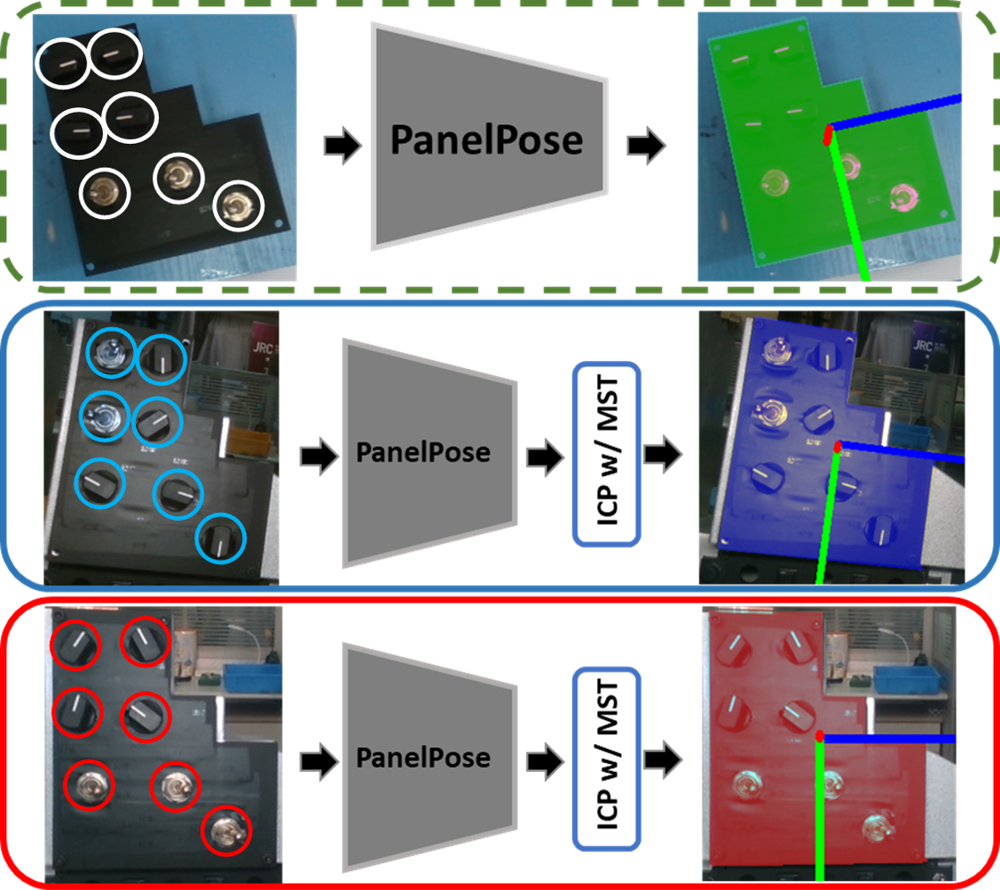
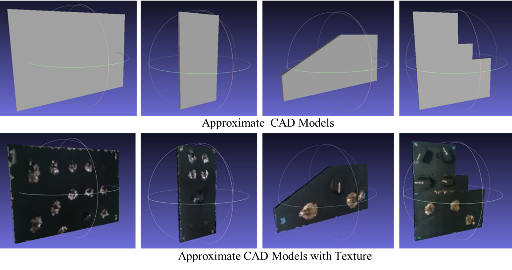
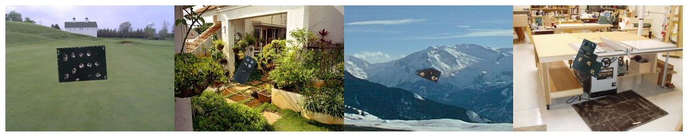
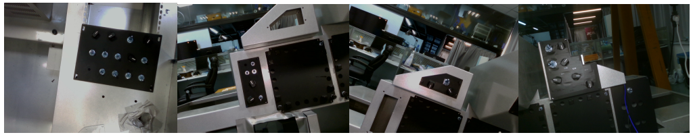
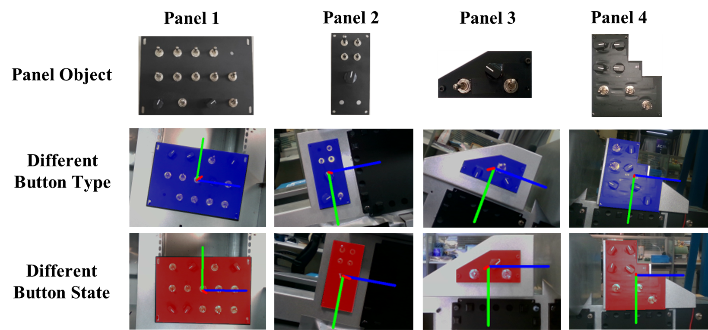
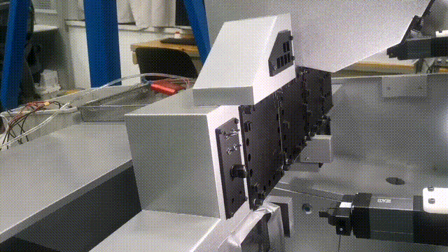

# PanelPose
This are the official source code and datasets for ***PanelPose: A 6D Panel Object Pose Estimation for Robotic Panel Inspection***.  


<br/>


## Introduction
- The keypoint selection method (Edge-FPS and FLD-FPS) in the **tools** file, the render code in the **lib** file.
- To address the problem of highly-variable panel pose estimation, we propose a simple yet effective method denoted as PanelPose that explicitly takes the extra feature maps along with RGB image as CNN input. We extract edge and line features of RGB image and fuse these feature maps as a multi-feature fusion map (MFF Map). Moreover, at the output representation stage, we design a simple but effective keypoint selection algorithm considering the shape information of panel objects, which simplifies keypoint localization for precise pose estimation.

## Installation
- Install CUDA10.1, torch==1.6.0, torchvision==0.7.0
- Set up python environment from requirement.txt:
  ```shell
  pip3 install -r requirement.txt 
  ```

## Datasets
- The dataset includes model with texture, synthetic data, and real-world data.
- The CAD models

<br/>
- The render image.

<br/>
- The test image.

<br/>


## demo
- In this demo, our pipline is used to estimate the panel pose and guides the robot to operate the buttons.
<br/>



