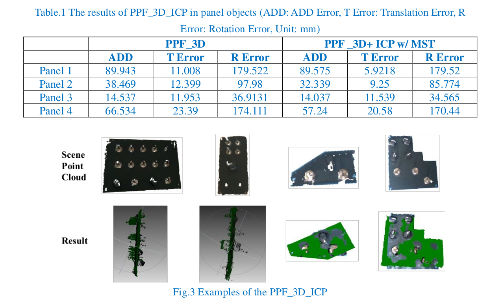

# PanelPose
This are the official source code and datasets for ***PanelPose: A 6D Panel Object Pose Estimation for Robotic Panel Inspection***.  


<br/>


## Introduction
- **We'll upload the code and dataset step by step.** Now,the repository includes keypoint selection method (Edge-FPS and FLD-FPS) in the **tools** file, and the render code in the **lib** file. The rest of the code will be uploaded later.
- The dataset is published in [dataset](https://cowtransfer.com/s/d198a5118fe34e) (code: xhbn26)
- To address the problem of highly-variable panel pose estimation, we propose a simple yet effective method denoted as PanelPose that explicitly takes the extra feature maps along with RGB image as CNN input. We extract edge and line features of RGB image and fuse these feature maps as a multi-feature fusion map (MFF Map). Moreover, at the output representation stage, we design a simple but effective keypoint selection algorithm considering the shape information of panel objects, which simplifies keypoint localization for precise pose estimation.

## Installation
- Install CUDA10.1, torch==1.6.0, torchvision==0.7.0
- Set up python environment from requirement.txt:
  ```shell
  pip3 install -r requirement.txt 
  ```

## Datasets
- The dataset includes model with texture, synthetic data, and real-world data.
- The CAD models
<br/>
- The render image.
<br/>
- The test image.
<br/>


## demo
- In this demo, our pipline is used to estimate the panel pose and guides the robot to operate the buttons.


<br/>


## Compare with PPF_3D_ICP 
- we also implemented the PPF_3D_ICP which is the best performance in the core datasets of the BOP Challenge (shown in Fig.1). We use the approximate CAD models of panels shown in Fig.2 to train the PPF detector, and the PPF estimates the panel pose from the cropped scene point cloud. We also add the multi-scale ICP with the multi-state point cloud template for refinement. The results of the PPF_3D_ICP including the ADD error, translation error, and rotation error are shown in Table.1. As we all know, the PPF method extracts point pair features from the 3D model and votes for the pose, which means this method relies on the precise 3D model. In this task, due to the lack of precise CAD models, the PPF detector trained by the approximate CAD models cannot provide good initial pose for the multi-scale ICP. Especially, the rotation error is so big that the ICP cannot work. Examples of the PPF_3D_ICP are shown in Fig.3, the green point cloud means the estimated pose, which shows the poor performance and big
rotation errors.


<br/>


