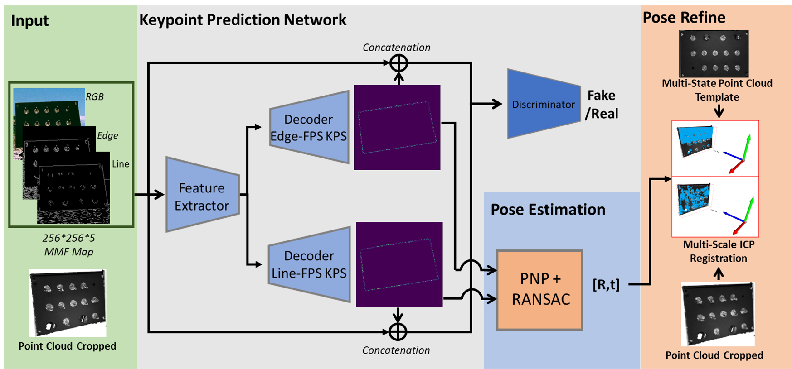

# PanelPose
This are the official source code and datasets for ***PanelPose: A 6D Panel Object Pose Estimation for Robotic Panel Inspection***. 

<!-- <div align=center> </div> -->


<div align=center><br/> </div> 


## Installation
- Install CUDA10.0
- Set up python environment from requirement.txt:
  ```shell
  pip3 install -r requirement.txt 
  ```

## Datasets
- **LineMOD:** Download the preprocessed LineMOD dataset from [here](https://drive.google.com/drive/folders/19ivHpaKm9dOrr12fzC8IDFczWRPFxho7) (refer from [DenseFusion](https://github.com/j96w/DenseFusion)). Unzip it and link the unzipped ``Linemod_preprocessed/`` to ``pvn3d/datasets/linemod/Linemod_preprocessed``:
  ```shell
  ln -s path_to_unzipped_Linemod_preprocessed pvn3d/dataset/linemod/
  ```


